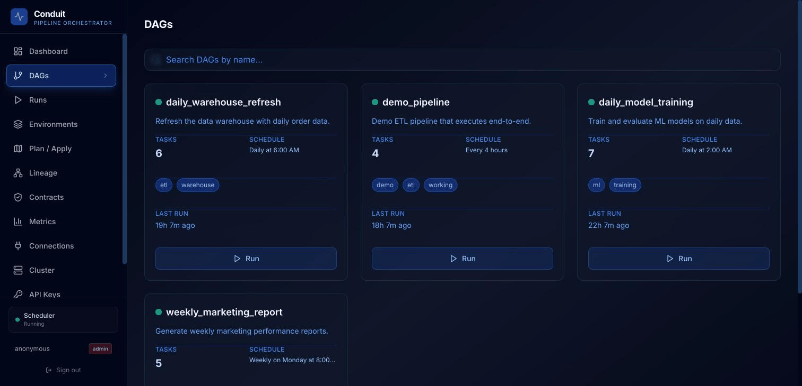
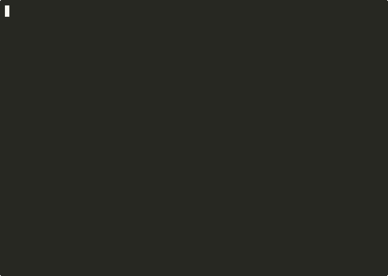

# Conduit

**A Rust-native data pipeline orchestrator.**

Conduit is not "Airflow but faster." It solves problems that Airflow architecturally *cannot* solve — virtual pipeline environments, time-travel debugging, compile-time DAG validation, and plan/apply deployments — all in a single binary with no external services (no database, no message broker; task execution shells out to your `python3`/`bash`).



## Install

**Prebuilt binary (recommended):**

```bash
curl -sSL https://raw.githubusercontent.com/jayhere1/conduit/main/scripts/install.sh | sh
```

Installs the latest release to `~/.local/bin/conduit` (no sudo). Binaries for
Linux (x86_64/aarch64, musl) and macOS (Intel/Apple Silicon) are attached to
[GitHub Releases](https://github.com/jayhere1/conduit/releases).

**From source:**

```bash
git clone https://github.com/jayhere1/conduit.git
cd conduit
cargo install --path conduit-cli   # installs `conduit` into ~/.cargo/bin
```

(`cargo build --release` also works — the binary lands at `target/release/conduit`;
add it to your PATH yourself.)

**Docker:**

```bash
docker run -p 9090:9090 -v "$PWD/dags:/data/dags" ghcr.io/jayhere1/conduit:latest
```

The image bundles the API server, web UI, and Python runtime. `docker compose up`
also works from a checkout (pulls the published image; add `--build` to build
locally).

📖 **Documentation:** <https://jayhere1.github.io/conduit/>

## Quick Start



```bash
# Initialize a project
conduit init my-project
cd my-project

# Compile DAGs (tree-sitter parses Python without executing it)
conduit compile

# Run a DAG end-to-end
conduit run hello_world

# Show what would change in production
conduit plan production

# Apply the changes
conduit apply production -y

# Create a virtual environment (instant, zero data copy)
conduit env create staging --from production

# Promote staging to production when ready
conduit env promote staging production
```

## Project Structure

```
conduit/
  conduit-cli/          Binary entry point (conduit command)
  conduit-common/       Shared types: DAG model, errors, events, fingerprints, snapshots, config
  conduit-compiler/     Tree-sitter DAG parser + Kahn's algorithm dependency resolver + benchmarks
  conduit-state/        Event store (RocksDB) + snapshot store (RocksDB) + environment manager
  conduit-scheduler/    Event-driven task scheduling with cron, trigger rules, and pool management
  conduit-executor/     Process-based task runtime with timeout, retry, and sensor polling
  conduit-planner/      Fingerprint diffing, impact analysis, and plan/apply deployment workflow
  conduit-lineage/      Column-level SQL lineage via sqlparser-rs AST + TableCatalog
  conduit-providers/    Data source adapters: 12 implemented (Postgres, MySQL, SQLite,
                        CockroachDB, Redshift, TimescaleDB, BigQuery, Snowflake, S3, GCS,
                        DuckDB, HTTP/REST) plus 20 provider stubs
  conduit-api/          REST + WebSocket API with live run dispatch
  conduit-distributed/  Distributed executor for multi-node task dispatch
  conduit-ui/           React web UI (DAG visualization, run monitoring, log streaming)
  conduit-python/       PyO3 bindings for embedding Conduit in Python
  conduit-wasm/         WASM plugin sandbox for custom task types
  conduit-bench/        Criterion benchmarks
  dags/                 Sample DAG definitions
  sdk/python/           Python SDK for authoring DAGs
```

## What's Implemented

### DAG Compiler (`conduit-compiler`)
Tree-sitter parses Python `@dag`/`@task` definitions **without executing Python**. Extracts schedules, tags, retry policies, pools, timeouts, and data-flow dependencies from call chains. Kahn's algorithm detects cycles, duplicates, and unknown references at compile time. Includes Criterion benchmarks for 10–1,000 DAG workloads.

### Event-Driven Scheduler (`conduit-scheduler`)
Fully async tokio-channel scheduler (no database polling). Manages task state machines (Pending → Queued → Success/Failed/Skipped/Retrying). Evaluates trigger rules (AllSuccess, AllDone, OneSuccess, OneFailed, NoDeps), enforces named resource pools declared in `conduit.yaml` (slot-limited, shared across runs), retries failed tasks with fixed or exponential backoff, and fires 5-field cron schedules (`conduit serve` ticks the scheduler every minute).

### Task Executor (`conduit-executor`)
Process-isolated task execution with a stdout protocol (`CONDUIT::` lines) and env/file-based XCom injection. Supports Python, Bash, SQL, Sensor, and generic Executable task types. Enforces timeouts via `tokio::time::timeout` and parses structured protocol messages (XCOM, LOG, PROGRESS, METRIC) from task output. Retries are owned by the scheduler: fixed delay by default, exponential when a task sets `retry_backoff` (e.g. `@task(retries=3, retry_delay="30s", retry_backoff=2.0)`), and the scheduler re-dispatches the task itself when the delay elapses. Sensor tasks poll at configurable `poke_interval` until success or timeout. Tasks are dispatched concurrently via `tokio::spawn`.

### Data Providers (`conduit-providers`)
12 implemented providers with real database/API connections:
- **SQL**: PostgreSQL, MySQL, SQLite, CockroachDB, TimescaleDB, Redshift (via sqlx connection pools), DuckDB (embedded)
- **Cloud**: BigQuery and Snowflake (REST APIs), S3 and GCS (object storage)
- **HTTP**: REST API provider (via reqwest)
- 20 additional providers stubbed with the trait interface ready for implementation (they report `NotImplemented` rather than pretending to work)

All sqlx providers use lazy connection pooling and percent-encoded credentials. Task SQL supports named `:param` placeholders, rewritten to native placeholders and bound as real query parameters (never string-spliced).

### SQL Lineage (`conduit-lineage`)
Column-level lineage via `sqlparser-rs` AST walking (not regex). Handles SELECT, JOINs, CTEs, UNIONs, subqueries, window functions, INSERT...SELECT, and CREATE TABLE AS SELECT. Optional `TableCatalog` integration enables bare column resolution, `SELECT *` expansion, CTE column propagation, and view column registration. OpenLineage RunEvent generation emits output `columnLineage` facets. Lineage is currently labeled **beta** — known limitations include semantic dbt/Jinja resolution and dialect-specific constructs such as BigQuery `SELECT * EXCEPT`.

### REST API + Web UI (`conduit-api`, `conduit-ui`)
Axum-based REST API with WebSocket event streaming. The API dispatches runs to the scheduler (not just recording intent). React web UI provides DAG visualization, run monitoring, task state tracking, and log streaming.

### Plan/Apply Workflow (`conduit-planner`)
Terraform-style change detection and deployment. Computes content-addressable fingerprints for every task in topological order (upstream changes cascade automatically). Compares against environment state, classifies changes as Added/Modified/UpstreamInvalidated/Removed/Unchanged. Impact analyzer computes full transitive blast radius via BFS. Generates serializable deployment plans with snapshot reuse optimization.

### State Layer (`conduit-state`)
- **Event Store**: Append-only RocksDB log with monotonic sequencing, range queries, and crash-safe recovery via `seek_to_last()`.
- **Snapshot Store**: RocksDB-backed with column families for snapshots and fingerprint index. Content-addressable fingerprint lookups for O(1) snapshot reuse.
- **Environment Manager**: Virtual pipeline environments inspired by SQLMesh. Create/fork/promote/rollback as pointer operations over immutable snapshots.

### CLI Commands
| Command | Description |
|---|---|
| `conduit init <name>` | Scaffold a new project with example DAG |
| `conduit compile [path]` | Parse and validate DAGs, report results |
| `conduit run <dag_id>` | Compile, schedule, and execute a DAG end-to-end |
| `conduit serve` | Start the API server + scheduler + executor + Web UI |
| `conduit plan [env]` | Show what would change in an environment |
| `conduit apply [env]` | Execute changes and update environment state |
| `conduit env create <name>` | Create a virtual environment (forked from production) |
| `conduit env list` | List all environments |
| `conduit env promote <src> <dst>` | Promote one environment into another |
| `conduit env diff <a> <b>` | Show added/removed/changed snapshots between environments |
| `conduit env history <name>` | Show an environment's version history |
| `conduit env rollback <name>` | Roll back an environment to a prior version |
| `conduit env set-policy <name>` | Set or clear an environment's promotion policy |
| `conduit lineage extract <dag.task>` | Extract SQL lineage for a task (`--openlineage` emits a RunEvent) |
| `conduit lineage trace --dag <id> --column <task.col>` | Trace a column across task boundaries (Python → SQL → Python) |
| `conduit impact --base <ref> --head WORKING` | Schema-impact report between two DAG versions (CI gate) |
| `conduit backfill <dag>` | Run a DAG across a date/partition range |
| `conduit replay` | Replay events to reconstruct historical state |
| `conduit query <sql>` | Run SQL locally (powered by DuckDB) |
| `conduit preview <dag.task>` | Preview a SQL task's output locally |
| `conduit worker` | Start a distributed worker node |
| `conduit cluster` | Query distributed cluster status |
| `conduit migrate <path>` | Convert Airflow DAGs to Conduit format |
| `conduit status` | Show system status |

## Build Requirements

- Rust stable toolchain (CI tracks `stable`; the Docker image builds on 1.91)
- clang/llvm (for RocksDB and tree-sitter compilation)
- On Ubuntu: `apt install clang librocksdb-dev`
- On macOS: `brew install llvm rocksdb`

## Run Tests

```bash
cargo test --workspace
```

## Run Benchmarks

```bash
# Compile 10/100/500/1,000 DAGs and measure parse time
cargo bench -p conduit-compiler
```

## Architecture

**Core insight**: Orchestration is a systems problem being solved with a scripting language. Conduit moves the CPU-bound work (DAG parsing, dependency resolution, scheduling, state management) to Rust while keeping the user-facing SDK in Python.

**Key design decisions**:
1. **Event-sourced state** (not mutable database) — enables time-travel, rollback, zero lock contention
2. **Compile-time validation** (not runtime) — tree-sitter parses DAGs without executing Python
3. **Virtual environments** (not physical copies) — snapshot pointers, not data duplication
4. **Event-driven scheduling** (not polling) — react to state changes via tokio channels
5. **Content-addressable snapshots** — fingerprint-based reuse skips unchanged tasks automatically
6. **Process isolation** — tasks run as child processes with enforced timeouts (declared CPU/memory limits are carried in the task model but not yet enforced)

**What makes this architecturally different from Airflow/Dagster/Prefect**:
- They poll a database to find ready tasks; Conduit reacts to events in microseconds.
- They re-execute entire pipelines on change; Conduit fingerprints each task and only re-executes what changed.
- They have no concept of pipeline environments; Conduit creates virtual environments as pointer swaps in O(1).
- They store mutable state; Conduit uses an append-only event log enabling time-travel and instant rollback.
- They parse Python by executing it; Conduit uses tree-sitter for zero-execution static analysis.

## License

Apache-2.0
