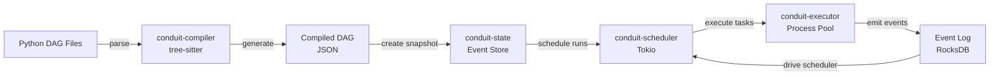
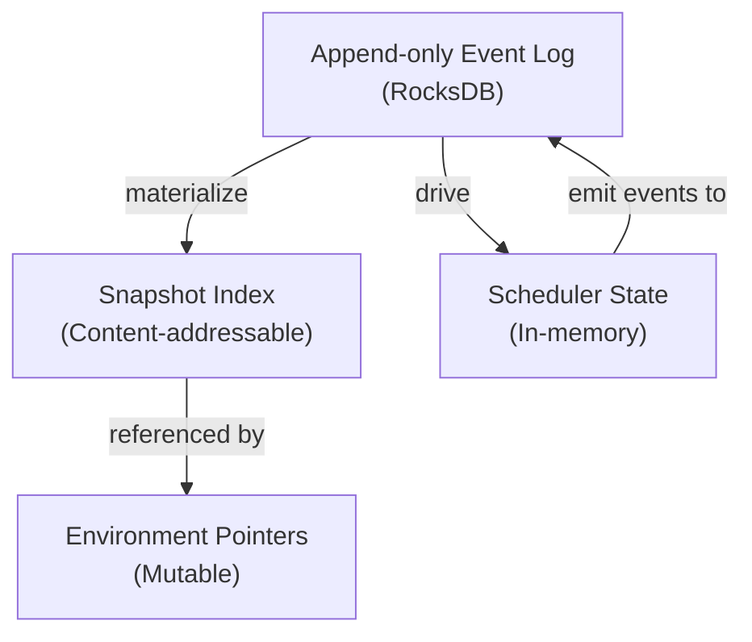
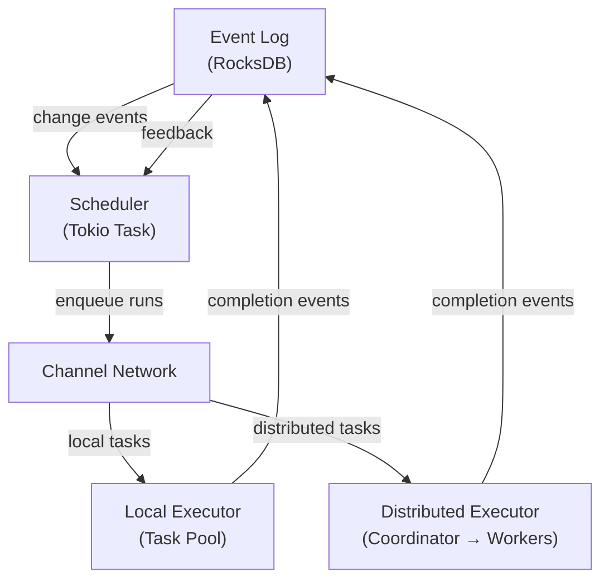
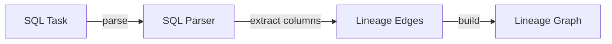

# System Architecture

This document describes Conduit's internal architecture, data flow, and design decisions.

## Crate Layout

Conduit is organized into **11 specialized crates** plus 3 optional extension crates:

```
conduit/
├── conduit-common/        Shared types, errors, events, config, contracts
├── conduit-compiler/      Tree-sitter DAG parser + Kahn's algorithm
├── conduit-state/         RocksDB event store + snapshots + environments
├── conduit-scheduler/     Tokio-based event loop + task scheduling
├── conduit-executor/      Process isolation + task runtime
├── conduit-planner/       Fingerprint diffing + impact analysis
├── conduit-lineage/       SQL parsing + column-level lineage
├── conduit-api/           REST API (37 endpoints) + WebSocket
├── conduit-providers/     32-provider ecosystem + secrets backends
├── conduit-distributed/   Leader-worker distributed execution (gRPC)
├── conduit-cli/           CLI entry point
│
├── conduit-bench/         (excluded) Benchmarks
├── conduit-python/        (excluded) PyO3 native bindings (the SDK is sdk/python)
└── conduit-wasm/          (excluded) WebAssembly target
```

Each crate is independently testable and has a single responsibility.

## Data Flow: Compile → Schedule → Execute → Store



### 1. Compilation Phase (conduit-compiler)

**Input**: Python source files with `@dag` and `@task` decorators

**Process**:
1. **Tree-sitter parsing**: Extract AST without executing Python
2. **Function extraction**: Find all `@task` and `@dag` definitions
3. **Dependency resolution**: Build call graph using Kahn's algorithm
4. **Validation**: Detect cycles, missing tasks, circular dependencies
5. **Fingerprint generation**: Compute content-addressable hash

**Output**: Compiled DAG structure

```rust
pub struct CompiledDAG {
    pub dag_id: String,
    pub tasks: Vec<CompiledTask>,
    pub dependencies: HashMap<String, Vec<String>>,
    pub fingerprint: String,
    pub schedule: Option<String>,
    pub created_at: DateTime,
}
```

### 2. Snapshot Creation (conduit-state)

**Input**: Compiled DAG from compiler

**Process**:
1. **Fingerprint indexing**: Map fingerprint → compiled task
2. **Snapshot serialization**: Convert compiled DAG to JSON
3. **Content addressing**: Store by fingerprint, not by name
4. **Reuse detection**: Check if fingerprint already exists

**Output**: Immutable snapshot ID

```rust
pub struct Snapshot {
    pub snapshot_id: String,
    pub fingerprint: String,
    pub tasks: HashMap<String, CompiledTask>,
    pub size_bytes: usize,
    pub created_at: DateTime,
}
```

### 3. Environment Pointer (conduit-state)

**Input**: Snapshot ID

**Process**:
1. **Create environment record**: Link name → snapshot
2. **Schedule lookup**: Get cron schedule for DAG
3. **Trigger registration**: Register event triggers

**Output**: Environment pointer

```rust
pub struct Environment {
    pub name: String,
    pub snapshot_id: String,
    pub created_at: DateTime,
    pub schedules: HashMap<String, String>, // dag_id → cron
}
```

### 4. Scheduling Phase (conduit-scheduler)

**Input**: Event log (DAG compiled, environment created)

**Process**:
1. **Event observation**: Tokio channels watch for state changes
2. **Cron evaluation**: For each scheduled DAG, check if should run
3. **Trigger rule evaluation**: Check upstream task statuses
4. **Pool enforcement**: Respect concurrency limits
5. **Task queuing**: Insert into run queue with dependencies

**Output**: Scheduled run

```rust
pub struct ScheduledRun {
    pub run_id: String,
    pub dag_id: String,
    pub scheduled_time: DateTime,
    pub tasks: Vec<ScheduledTask>,
}
```

### 5. Execution Phase (conduit-executor / conduit-distributed)

**Input**: Scheduled task

**Local execution** (conduit-executor):
1. **Isolation**: Spawn child process with isolated environment
2. **Input injection**: Pass task inputs via stdin JSON
3. **Timeout enforcement**: Kill process if exceeds limit
4. **Protocol parsing**: Read stdout for XCOM/LOG/PROGRESS/METRIC
5. **Retry logic**: On failure, schedule retry with backoff
6. **Event emission**: Emit TaskStarted, TaskCompleted, etc.

**Distributed execution** (conduit-distributed):
1. **Task routing**: Coordinator assigns task to available worker via gRPC
2. **Pool affinity**: Match task pool requirements to worker capabilities
3. **Remote execution**: Worker executes task with same protocol parsing
4. **Result forwarding**: Worker reports result back through coordinator
5. **Health monitoring**: Heartbeat-based worker health tracking
6. **Reassignment**: Dead worker tasks are automatically requeued

**Output**: Task completion event

```rust
pub struct TaskCompletion {
    pub task_id: String,
    pub run_id: String,
    pub status: TaskStatus, // success | failed | skipped
    pub exit_code: i32,
    pub duration_ms: u64,
    pub xcom: HashMap<String, String>,
}
```

### 6. Event Storage (conduit-state)

**Input**: Task completion event

**Process**:
1. **Event serialization**: Convert to JSON
2. **Write-ahead logging**: Pre-write to RocksDB log
3. **Monotonic sequencing**: Assign event sequence number
4. **Snapshot materialization**: Update cached DAG state

**Output**: Durable event in append-only log

## Provider Ecosystem (conduit-providers)

Conduit supports **32 data providers** across 6 categories, all implementing a unified async trait hierarchy:

```rust
#[async_trait]
pub trait Provider: Send + Sync {
    fn info(&self) -> ProviderInfo;
    async fn test_connection(&self) -> Result<ConnectionTestResult, ProviderError>;
    async fn close(&self) -> Result<(), ProviderError>;
}
```

Specialized traits extend the base: `SqlProvider`, `StorageProvider`, `HttpProvider`, `StreamProvider`, `SaasProvider`, and `DocumentProvider`.

### Provider Categories

**SQL Databases (12)**: PostgreSQL, MySQL, SQLite, DuckDB, Snowflake, BigQuery, Redshift, Databricks, ClickHouse, Oracle, SQL Server, TimescaleDB, CockroachDB

**Object Storage (3)**: AWS S3, Google Cloud Storage, Azure Blob Storage

**HTTP/API (3)**: Generic REST, GraphQL, Webhook

**Streaming (4)**: Apache Kafka, RabbitMQ, AWS Kinesis, Google Pub/Sub, Redis Streams

**SaaS (5)**: Salesforce, Stripe, Slack, GitHub, Twilio

**Document/NoSQL (6)**: MongoDB, DynamoDB, Cassandra, Elasticsearch, Redis, Neo4j

### Secrets Management

The provider registry integrates with pluggable secrets backends for credential resolution, supporting environment variables, file-based secrets, and external vaults.

## Distributed Execution (conduit-distributed)

### Architecture

```text
  ┌─────────────────────────────────────────┐
  │  Coordinator (leader node)              │
  │  ├── WorkerPool (tracks workers)        │
  │  ├── Task queue (pending assignments)   │
  │  └── gRPC server (:9400)                │
  └────────────┬───────────────┬────────────┘
               │ gRPC          │ gRPC
         ┌─────▼─────┐  ┌─────▼─────┐
         │ Worker-1  │  │ Worker-2  │
         │ cap: 4    │  │ cap: 8    │
         │ pool: gpu │  │ pool: *   │
         └───────────┘  └───────────┘
```

### gRPC Protocol (5 RPCs)

1. **Register**: Worker joins the cluster with capacity and pool affinity
2. **ReportResult**: Worker sends task completion with metrics and XCom
3. **Heartbeat**: Bidirectional health check and directive delivery
4. **StreamLogs**: Real-time log streaming from workers to coordinator
5. **ClusterStatus**: Query cluster health, worker states, pending/inflight counts

### Routing Strategies

The WorkerPool supports three task routing strategies:

- **LeastLoaded**: Assign to the worker with the fewest active tasks (default)
- **BinPack**: Fill workers to capacity before using the next
- **RoundRobin**: Cycle through workers in order

### Execution Modes

- **Local**: All tasks run on the scheduler node (single-node, backward compatible)
- **Distributed**: All tasks routed through the coordinator to remote workers
- **Hybrid**: Tasks with pool affinity go to workers; others run locally

### Health Monitoring

Workers send periodic heartbeats. The coordinator tracks three states:

- **Active**: Heartbeat received within 30 seconds
- **Disconnected**: No heartbeat for 30–120 seconds (no new tasks assigned)
- **Dead**: No heartbeat for 120+ seconds (tasks reassigned to healthy workers)

## Data Contracts (conduit-common)

Data contracts provide schema validation, SLA enforcement, and quality checks:

```rust
pub struct DataContract {
    pub checks: Vec<ContractCheck>,
    pub severity: Severity, // Warning | Error | Critical
}
```

Contract evaluators validate data at DAG boundaries, with results surfaced in the UI and API.

## Core Concepts

### Fingerprints

A **fingerprint** is a deterministic hash of a task and all upstream dependencies:

```
Task: transform(data)
  Code hash: sha256(function_body) = abc123
  Timeout: 600 seconds
  Retries: 2
  Upstream fingerprints: [extract_task_fingerprint]

Computed fingerprint: sha256(abc123 + "600" + "2" + upstream_fingerprints) = f1a2b3c4d5e6
```

**Properties**:
- **Deterministic**: Same code always produces same fingerprint
- **Cascading**: If upstream fingerprint changes, downstream cascades
- **Content-addressable**: Fingerprint is the stable identifier, not task name

### Snapshots

A **snapshot** is an immutable, versioned collection of compiled DAGs:

```
Snapshot: prod-snap-20240322-143215
  Tasks:
    - daily_analytics_etl.extract (fingerprint: f1a...)
    - daily_analytics_etl.transform (fingerprint: g2h...)
    - daily_analytics_etl.load (fingerprint: m3n...)
  Size: 1.2 KB
  Created: 2024-03-22 14:32:15 UTC
```

Snapshots are **immutable** once created. To deploy changes, create a new snapshot.

### Environments

An **environment** is a **pointer** to a snapshot plus metadata:

```
Environment: production
  Snapshot: prod-snap-20240322-143215
  Schedules:
    - daily_analytics_etl: "0 2 * * *"
  Run history: [run1, run2, run3, ...]
```

Promoting an environment is just changing the pointer: O(1), zero data copy.

### Events

An **event** is an immutable record of something that happened:

```rust
pub enum Event {
    DAGCompiled {
        dag_id: String,
        fingerprint: String,
        timestamp: DateTime,
    },
    TaskStarted {
        run_id: String,
        task_id: String,
        timestamp: DateTime,
    },
    TaskCompleted {
        run_id: String,
        task_id: String,
        status: TaskStatus,
        xcom: Map<String, String>,
        timestamp: DateTime,
    },
    SnapshotDeployed {
        snapshot_id: String,
        environment: String,
        timestamp: DateTime,
    },
    // ... 20+ other event types
}
```

All state is **derived** from events. Events are the **source of truth**.

## State Model



### Event Store (RocksDB)

```
Key-Value Store:
  event_sequence_000001 → {DAGCompiled event}
  event_sequence_000002 → {TaskStarted event}
  event_sequence_000003 → {TaskCompleted event}
  ...

Index:
  run:run123 → [event_seq_10, event_seq_11, event_seq_12, ...]
  task:extract → [event_seq_2, event_seq_8, event_seq_15, ...]
```

Properties:
- **Append-only**: Never overwrite, only append
- **Durable**: Write-ahead logging ensures no data loss
- **Indexed**: Range queries for efficient lookups
- **Compactable**: Delete old events after retention period

## Change Detection: Plan/Apply

The **plan** phase compares two snapshots:

```
Current: prod-snap-20240322-143215 (old)
Proposed: (recompile from source)

Tasks in DAG:
  extract:
    Old fingerprint: f1a2b3c4d5e6
    New fingerprint: f1b3c4d5e6f7  ← Changed (timeout 300 → 600)
    Status: Modified

  transform:
    Old fingerprint: g2h3i4j5k6l7
    New fingerprint: g2i4j5k6l7m8  ← Changed (upstream extract changed)
    Status: UpstreamInvalidated

  load:
    Old fingerprint: m3n4o5p6q7r8
    New fingerprint: m3n4o5p6q7r8  ← Unchanged
    Status: Unchanged (will be reused)
```

The **apply** phase creates a new snapshot and updates the environment pointer.

## Scheduler Architecture



The scheduler is a **single Tokio task** listening to events. In distributed mode, the `DistributedExecutor` is a drop-in replacement for the local executor, using the same MPSC channel interface.

## Lineage Tracking (conduit-lineage)



Column-level lineage for SQL tasks, with upstream/downstream tracing exposed via the API.

## REST API (conduit-api)

The API layer exposes **37 REST endpoints** organized by domain:

- **DAGs**: list, get, graph, compile
- **Runs**: trigger, list, get, list-all
- **Environments**: list, create, get, delete, promote, diff
- **Lineage**: extract SQL, trace upstream/downstream, graph, schema diff
- **Contracts**: validate, list, per-dag, per-task
- **Providers**: list connections, get, test, list provider types
- **Plan/Apply**: generate plan, apply plan
- **Metrics**: list, get per-task
- **Cluster**: status, drain worker
- **Backfill**: create
- **System**: health check, system info, events list/get

## Web UI (conduit-ui)

A React-based dashboard with **16 pages**:

Dashboard, DAG List, DAG Detail, DAG Graph, Runs, Run Detail, Run Execution, Task Logs, Environments, Plan/Apply, Lineage, Contracts Dashboard, Metric Explorer, Connections, Events, Cluster

## Performance Characteristics

| Operation | Complexity | Typical Time |
|-----------|-----------|--------------|
| Compile DAG | O(n) where n=tasks | 50ms for 100 tasks |
| Create snapshot | O(1) | <1ms |
| Create environment | O(1) | <1ms |
| Promote environment | O(1) | <1ms |
| Query event log | O(log n) | <10ms |
| Time-travel to event | O(log n) | <50ms |
| Execute task | O(1) | varies (task-dependent) |
| Route task to worker | O(w) where w=workers | <1ms |

## Durability Guarantees

1. **Append-only log**: Events are never mutated
2. **Write-ahead logging**: Events are persisted before acknowledgment
3. **Atomic snapshots**: Snapshot creation is atomic
4. **Consistent pointers**: Environment pointers are atomic
5. **Crash recovery**: On restart, replay events to recover state

## Current Limitations and Trade-offs

### Limitations
- **No partial rollback**: Rollback is all-or-nothing for an environment
- **No authentication**: API key auth planned for future phase
- **Event log grows unbounded**: Retention policies can prune old events
- **gRPC transport only**: No REST fallback for distributed workers

### Trade-offs
- **Event sourcing latency**: Reconstructing state takes time, mitigated by snapshots
- **Snapshot size**: Larger DAGs create larger snapshots (but still O(n) where n=tasks)
- **Memory overhead**: Keeping scheduler state in-memory (can add persistence later)

## Testing

The workspace contains **558+ tests** across all crates:

```bash
cargo test --workspace
```

Test coverage spans unit tests (inline), integration tests (per-crate `tests/` directories), and property-based tests using proptest.

### Benchmarks

```bash
cargo bench -p conduit-compiler
```

Benchmarks for parsing DAGs (10–1,000 tasks), dependency resolution, fingerprint computation, and event log queries.

## Next Steps

- **[Event-Sourced Architecture](./concepts/events.md)**: How events drive the system
- **[Plan/Apply Workflow](./concepts/plan-apply.md)**: Change detection in detail
- **[CLI Reference](./cli-reference.md)**: User-facing commands that use this architecture
