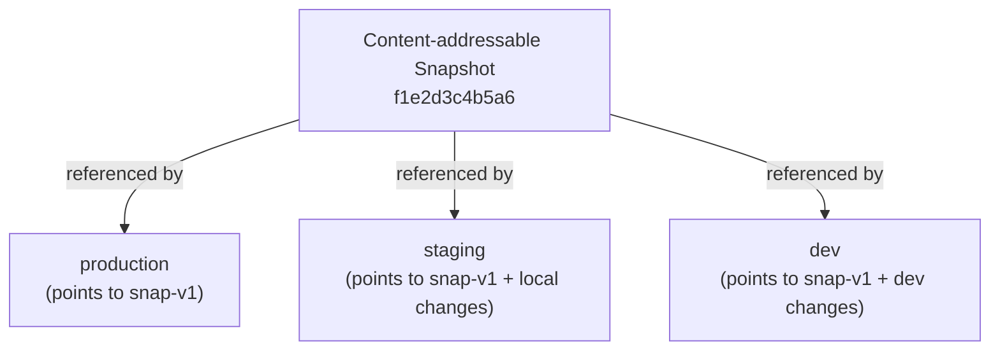

# Virtual Environments

Virtual environments in Conduit are isolated, independent versions of your pipeline. Unlike traditional systems that have a single mutable "production," Conduit lets you create multiple environments (production, staging, testing) that fork, diverge, and converge independently.

## Why Virtual Environments?

In Airflow or Dagster, testing changes before production means:
1. Deploy to a separate machine/cluster (expensive)
2. Or modify variables/connections (risky, error-prone)

In Conduit, creating a new environment is **instantaneous** and **zero-copy**:

```bash
# Fork production → staging (instant, no data copy)
conduit env create staging --from production
```

Staging now has its own independent pipeline state, schedule, and run history. Changes in staging don't affect production until you promote them.

## How Environments Work

Environments are **snapshot pointers**, not data copies:



When you create an environment, you create a **new pointer** to the same snapshot. No data is copied. Environment operations are O(1).

## Environment Lifecycle

### 1. Create an Environment

Fork an existing environment:

```bash
conduit env create staging --from production
```

Output:

```
Environment created: staging
Forked from: production (snapshot: prod-snap-20240322-143215)
Current snapshot: prod-snap-20240322-143215 (shared)
```

Staging now has an identical pipeline to production, but is completely independent. They share the snapshot, but have separate run histories and schedules.

### 2. Make Changes

Modify your DAG files:

```bash
# Edit your DAG definitions
vim dags/etl.py
```

Compile the changes:

```bash
conduit compile
```

### 3. Plan Changes

See what would change when you apply to the environment:

```bash
conduit plan staging
```

Output:

```
Planning changes for environment: staging
Current snapshot: prod-snap-20240322-143215

Added:
  - task_x (fingerprint: abc123...)

Modified:
  - task_y (timeout 300 → 600)

Unchanged:
  ✓ task_z (will be reused from snapshot)

Summary: 1 task added, 1 task modified, 1 task reused
Estimated snapshot size: 1.2 KB (35% smaller than full)
```

The plan shows exactly what changed and what will be reused from the previous snapshot.

### 4. Apply Changes

Deploy the plan to the environment:

```bash
conduit apply staging -y
```

Output:

```
Applying plan for environment: staging

✓ Updated daily_analytics_etl
  - task_x: compiled from source (new)
  - task_y: compiled from source (modified)
  - task_z: reused from snapshot (unchanged)

Snapshot ID: staging-snap-20240322-145123
Environment pointer: staging → staging-snap-20240322-145123
```

The environment now points to a new snapshot with your changes.

### 5. Promote to Production

When ready, promote the environment to production:

```bash
conduit env promote staging production
```

Output:

```
Promoting staging → production

Source: staging (staging-snap-20240322-145123)
Target: production (prod-snap-20240322-143215)
Backup: prod-snap-20240322-143215 archived as prod-snap-backup-20240322-145456

Environment updated: production
production → staging-snap-20240322-145123
```

Production now runs the new snapshot. The previous production snapshot is archived for rollback.

### 6. Rollback (Instant)

If something goes wrong, roll back instantly:

```bash
conduit env rollback production --to prod-snap-backup-20240322-145456
```

Output:

```
Rollback: production
From: staging-snap-20240322-145123
To: prod-snap-backup-20240322-145456

New snapshot: prod-snap-backup-20240322-145456
```

This is instantaneous. No data migration, no complex recovery. Just a pointer swap.

## Environment Operations

### List Environments

```bash
conduit env list
```

Output:

```
Available environments:

Name          Status      Snapshot                          DAGs  Tasks
──────────────────────────────────────────────────────────────────────
production    active      prod-snap-20240322-143215         5     32
staging       active      staging-snap-20240322-145123      5     34
dev           inactive    dev-snap-20240318-092345          5     35
```

### View Environment Details

```bash
conduit env info staging
```

Output:

```
Environment: staging
Status: active
Snapshot: staging-snap-20240322-145123
Snapshot size: 1.2 KB
Created: 2024-03-22 14:51:23 UTC
Last modified: 2024-03-22 14:51:23 UTC
Forked from: production
DAGs: daily_analytics_etl, hourly_metrics, user_segmentation, ...
Tasks: 34
Runs in last 24h: 0 (not scheduled)
```

### Archive Environment

Archive an unused environment to save metadata space:

```bash
conduit env archive dev
```

Output:

```
Archived environment: dev
Snapshot dev-snap-20240318-092345 archived
```

## Snapshot Management

Snapshots are the immutable artifacts that environments point to. They
live in the durable snapshot store at `.conduit/snapshots_db` and are
created by `conduit apply` (one per executed task).

There is no standalone snapshot CLI; you inspect snapshots through the
environments that reference them:

```bash
# Per-task snapshot pointers for an environment (API)
curl localhost:8080/api/v1/environments/production

# Compare the pointers of two environments
conduit env diff staging production

# See how the pointers changed over time
conduit env history production
```

Snapshots are never deleted automatically — old versions stay available
for `conduit env rollback`.

**Note**: You cannot delete a snapshot that's referenced by an active environment.

## Multi-Environment Workflows

### Example: Staging + Canary Release

```bash
# 1. Create a staging environment for testing
conduit env create staging --from production

# 2. Make changes
vim dags/etl.py
conduit compile
conduit plan staging
conduit apply staging -y

# 3. Test staging for a few days
# (run the scheduler, monitor metrics, etc.)

# 4. Create a canary: run 1% of traffic to new version
conduit env create canary --from production
# (same changes as staging)
conduit apply canary -y

# 5. Monitor canary for 24 hours
# If successful:

# 6. Roll out to 10% of production via gradual promotion
conduit env promote canary production

# If issues arise:
conduit env rollback production --to prod-snap-backup-20240322-145456
```

### Example: Feature Branch Environment

```bash
# 1. Create dev environment for feature work
conduit env create feature-new-transform --from production

# 2. Experiment freely
vim dags/transforms.py
conduit compile && conduit apply feature-new-transform -y

# 3. When ready, compare to production
conduit diff production feature-new-transform

# 4. Promote to staging first
conduit env promote feature-new-transform staging

# 5. Then to production
conduit env promote staging production
```

## Comparing Environments

See how two environments differ:

```bash
conduit diff production staging
```

Output:

```
Comparing: production vs staging

DAGs:
  ✓ daily_analytics_etl (both present)
  ✓ hourly_metrics (both present)
  + user_segmentation (in staging only)

Tasks in daily_analytics_etl:
  ✓ extract (unchanged)
  ✓ transform (unchanged)
  ⚠ load (timeout 600 → 1200)

Summary:
  Added: 1 DAG
  Modified: 1 task
  Unchanged: 9 tasks
```

## Schedules Are Per-DAG

Schedules are declared on the DAG itself (`schedule:` cron expression in
the DAG definition) and executed by the scheduler inside `conduit serve`.
There is no per-environment schedule override: cron-initiated runs
execute against the default (`production`) environment. To exercise a
DAG in another environment, trigger it explicitly:

```bash
conduit run daily_analytics_etl --env staging
```

or over the API with `{"environment": "staging"}`.

## Run History Carries the Environment

Every run records which environment it ran against, and history is
filterable by it:

```bash
# CLI status for one environment
conduit status --env production
```

```bash
# API: runs filtered by environment
curl 'localhost:8080/api/v1/runs?environment=staging'
```

All runs share one durable event log — the environment is a recorded
field on each run, not a separate stream.

## Best Practices

1. **Always test in staging first**: Catch issues before production.
2. **Use descriptive environment names**: `staging`, `canary`, `feature-{name}`, not `test1`, `test2`.
3. **Keep production unchanged until ready**: Use plan/apply workflow, never direct edits.
4. **Guard production promotions with a policy**: `conduit env set-policy production --require-source staging`.
5. **Document promotions**: Leave notes when promoting major changes.

## Limitations

- Environments are **pipeline-only**: They don't isolate data or external systems. A task in staging that writes to production still writes to production.
- **Snapshots are immutable**: Once created, a snapshot cannot be modified. Create a new one instead.
- **No partial rollback**: You roll back the entire environment, not individual tasks.

If you need data isolation (staging database separate from production), configure that at the task level:

```python
@task
def write_to_db(data):
    if os.getenv("CONDUIT_ENVIRONMENT") == "production":
        db_connection = "prod.example.com"
    else:
        db_connection = "staging.example.com"
    # Write to appropriate database
```

## Next Steps

- **[Plan/Apply Workflow](./plan-apply.md)**: Deep dive into fingerprinting and change detection
- **[CLI Reference](../cli-reference.md)**: All environment commands
- **[Architecture](../architecture.md)**: How snapshots and events work internally
