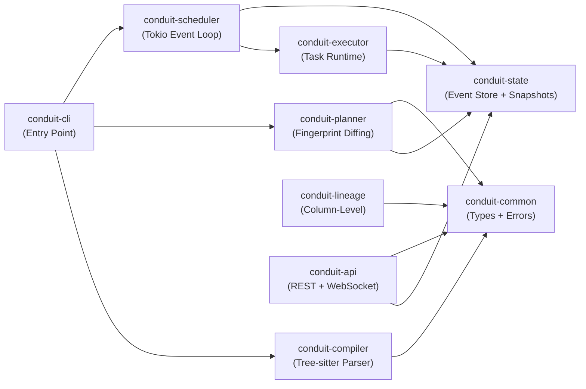

# Introduction to Conduit

## What is Conduit?

Conduit is a **Rust-native data pipeline orchestrator** designed from the ground up to solve problems that existing tools like Airflow, Dagster, and Prefect cannot solve architecturally.

Unlike traditional orchestrators that treat pipelines as mutable entities that change over time, Conduit treats them as **immutable artifacts**. Every DAG is compiled once, versioned, deployed via a Terraform-style plan/apply workflow, and executed in isolated virtual environments. This fundamental shift enables capabilities that are impossible in existing systems:

- **Virtual pipeline environments** (instant, zero data copy)
- **Time-travel debugging** (replay any run from the event log)
- **Sub-second compilation** (tree-sitter parses Python without executing it)
- **Fingerprint-based change detection** (only re-execute what changed)
- **Zero external dependencies** (everything in a single binary)

## Why Conduit Exists

### The Airflow Problem

Airflow is the market leader, but it has fundamental architectural limitations:

1. **Mutable state model**: Airflow stores DAG definitions and variables in a mutable database. When you change a DAG, Airflow re-executes it entirely. There's no way to safely roll back or test changes.

2. **Polling-based scheduling**: Airflow polls the database every 5–30 seconds looking for ready tasks. In microsecond-latency systems, this is unacceptable.

3. **No pipeline environments**: Airflow has no concept of "staging" vs "production" pipelines. You deploy a single DAG and hope nothing breaks.

4. **Runtime validation**: DAGs are validated at runtime via Python execution. Syntax errors and dependency cycles slip past development.

5. **Opaque lineage**: SQL lineage is either manual or tied to specific data systems. Column-level lineage is not standardized.

### Why Existing Alternatives Fall Short

- **Dagster** is more principled than Airflow but still uses mutable state and Python execution for DAG validation.
- **Prefect** focuses on flow composition, not structural validation or environment isolation.
- **dbt** is a great data transformation tool, but orchestration is a second-class citizen.
- **Temporal** is excellent for long-running workflows but not designed for batch data pipelines.

## Key Innovations

### 1. Fingerprint-Based Change Detection

Every task in a DAG is assigned a **content-addressable fingerprint** based on:
- The task definition (code, dependencies, configuration)
- Upstream task fingerprints (cascading invalidation)
- Schedule and trigger rules

When you deploy to production, Conduit compares the new fingerprints against the current environment. Only tasks that changed are marked for re-execution. Unchanged tasks automatically reuse cached outputs.

```
Task A (hash: abc123)
├─ Task B (hash: def456) — input changed
│  └─ Task C (hash: ghi789) — upstream changed, cascade invalidates
└─ Task D (hash: jkl012) — no changes
```

This is fundamentally different from Airflow, where changing one task triggers full re-execution.

### 2. Virtual Environments (SQLMesh Inspired)

Creating a new environment (staging, test, feature branch) is **O(1)** and consumes **zero data**:

```bash
# Instant, no copy
conduit env create staging --from production

# Make changes to DAG definitions
vim dags/etl.py

# Plan what would change
conduit plan staging

# Apply changes
conduit apply staging -y

# Promote to production when ready
conduit env promote staging production
```

Environments are **snapshots**: pointers to immutable compiled DAGs. Promoting an environment is just moving a pointer. Rolling back is instant.

### 3. Event-Sourced State

Conduit stores an **append-only event log** instead of mutable database state:

```
1. DAGCompiled(dag_id, fingerprint, timestamp)
2. EnvironmentCreated(staging, fork_of=production)
3. SnapshotDeployed(staging, fingerprint, timestamp)
4. DAGScheduled(etl_pipeline, run_id, scheduled_time)
5. TaskStarted(run_id, task_id, timestamp)
6. TaskCompleted(run_id, task_id, xcom_output, timestamp)
7. DAGCompleted(run_id, status, timestamp)
```

From this immutable log, you can:
- **Time-travel**: Replay any run from the original event
- **Rollback**: Point production back to a previous environment snapshot
- **Debug**: Inspect exactly what changed and when
- **Audit**: Complete history of all pipeline mutations

### 4. Sub-Second Compilation

Conduit uses **tree-sitter** to parse Python DAG definitions *without executing Python code*. This is radically faster and safer than Airflow's approach:

```python
# This won't execute during compilation
@dag
def my_dag():
    t1 = python_task("import os; os.system('rm -rf /')")  # Safe!
    t2 = python_task("requests.get('http://evil.com')")   # Safe!
    return t1 >> t2
```

Tree-sitter extracts the DAG structure, task dependencies, schedules, and retry policies without ever running untrusted code. Compilation takes **milliseconds** for DAGs with hundreds of tasks.

### 5. Process-Based Execution

Each task runs as an **isolated child process** with:
- Timeout enforcement (no hung tasks)
- Exit-code based success/failure detection
- Resource limits via cgroups (CPU, memory, file descriptors)
- Structured protocol for logging, metrics, and XCom

Tasks communicate via stdout:
```
LOG|INFO|Starting task
XCOM|key1|value1
PROGRESS|50
METRIC|rows_processed|1000
```

The executor parses these messages in real-time, no database polling.

### 6. Type-Safe DAG Definition

The Python SDK enforces structure at definition time:

```python
from conduit.sdk import dag, task, Pool

@dag(
    schedule="0 9 * * *",  # 9 AM daily
    retries=2,
    timeout=3600,
    pool=Pool.name("api_requests", size=5)
)
def etl_pipeline():
    raw = extract()
    clean = transform(raw)
    load(clean)
    return clean
```

No magic strings, no dictionary literals, full IDE autocomplete.

## Architecture Overview

Conduit is built as **9 specialized crates**:



Each crate is responsible for one concern:
- **conduit-common**: Shared type definitions (DAG model, errors, events)
- **conduit-compiler**: Tree-sitter DAG parsing + dependency resolution
- **conduit-state**: Event store (RocksDB) + snapshot manager
- **conduit-scheduler**: Cron, trigger rules, pool management, run state machine
- **conduit-executor**: Process-based task execution with timeouts and retries
- **conduit-planner**: Fingerprint diffing and impact analysis
- **conduit-lineage**: Column-level lineage (Phase 4)
- **conduit-api**: REST and WebSocket API (Phase 2)
- **conduit-python**: Python SDK and tree-sitter bindings

## Comparison Matrix

| Feature | Airflow | Dagster | Prefect | Conduit |
|---------|---------|---------|---------|---------|
| **Compile-time validation** | No | No | No | ✓ |
| **Virtual environments** | No | No | No | ✓ |
| **Event-sourced state** | No | No | No | ✓ |
| **Fingerprint-based caching** | No | No | No | ✓ |
| **Zero external dependencies** | No | No | No | ✓ |
| **Column-level lineage** | Partial | Yes | No | ✓ (Phase 4) |
| **REST API** | Yes | Yes | Yes | ✓ (Phase 2) |
| **Cloud-native** | Yes | Yes | Yes | ✓ |
| **Production-ready** | ✓ | ✓ | ✓ | Active dev |

## Next Steps

- **[Installation](../getting-started/installation.md)**: Set up Conduit
- **[Quick Start](../getting-started/quick-start.md)**: Create your first DAG in 5 minutes
- **[Concepts](../concepts/dags.md)**: Understand DAG definitions, environments, and the plan/apply workflow
